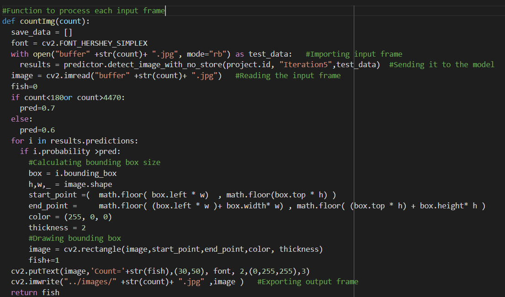
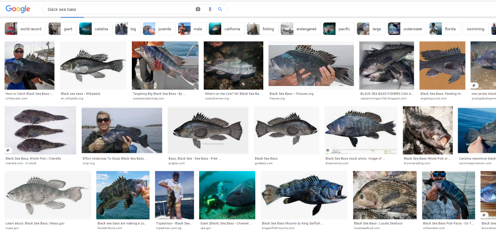
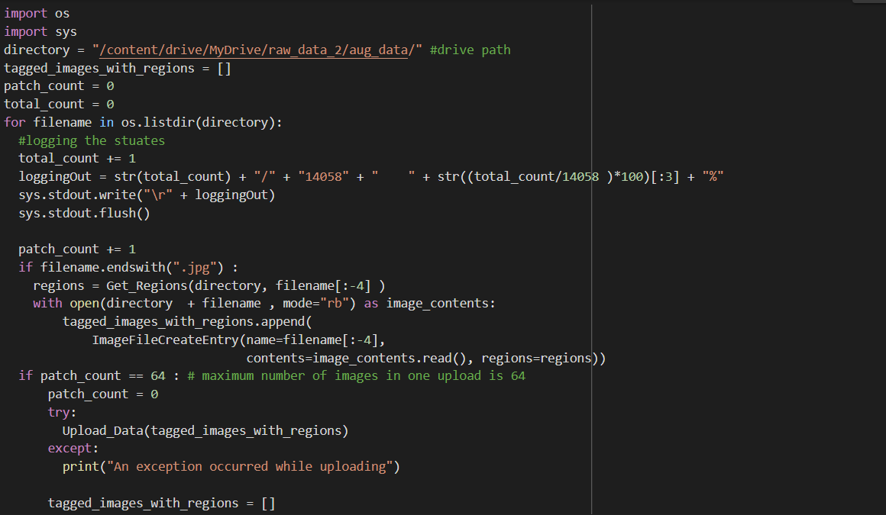
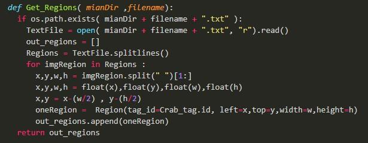
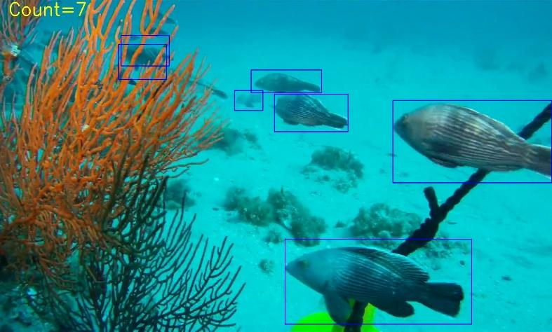

# Fish Counting Project

This project involves processing video data to count the number of fish in each frame using Azure Custom Vision and plotting the results. The project uses various technologies including Azure Custom Vision, Detecto, and PyTorch.

## Project Overview

1. **Data Collection and Annotation**:
    - Collected fish data from various sources including Google Images and Creative Commons.
    - Annotated images using LabelImg and uploaded them to Google Drive.

2. **Model Training**:
    - Trained an object detection model using PyTorch and Detecto in Google Colab.
    - Used Azure Custom Vision for additional training and prediction.

3. **Frame Extraction and Counting**:
    - Extracted frames from video and processed each frame to count the number of fish.
    - Used bounding boxes to visualize detected fish.

4. **Data Plotting**:
    - Plotted the fish count data using matplotlib.
    - Applied various smoothing techniques for better visualization.

## Getting Started

### Prerequisites

- Python 3.7+
- Azure SDK
- PyTorch
- Detecto
- OpenCV
- Pandas
- Matplotlib

### Installation

1. Clone the repository:
    ```bash
    git clone https://github.com/MatthewNader2/Fish-Counting-Project.git
    cd fish-counting-project
    ```

2. Install the required dependencies:
    ```bash
    pip install -r requirements.txt
    ```

### Usage

1. Annotate images and upload to Google Drive.
2. Train the model using provided scripts.
3. Extract frames from the video and count fish in each frame.
4. Plot the results using matplotlib.

### Code Structure

- `data/`: Contains the annotated images and CSV files.
- `scripts/`: Contains the scripts for data preprocessing, model training, and inference.
- `notebooks/`: Jupyter notebooks for exploratory data analysis and model evaluation.

### Examples

Here are some sample images used in the project:









### License

This project is licensed under the MIT License - see the [LICENSE](LICENSE) file for details.

## Acknowledgments

- Azure Custom Vision
- Google Images
- Creative Commons
