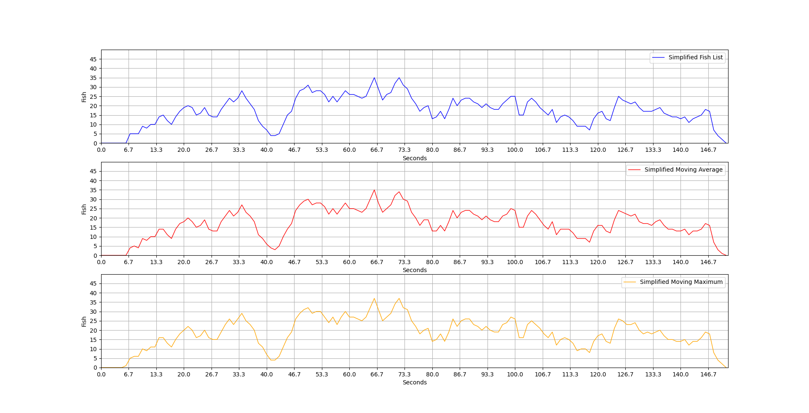

# Fish Counting Project


This project involves processing video data to count the number of fish in each frame using Azure Custom Vision and plotting the results. The project uses various technologies including Azure Custom Vision, Detecto, and PyTorch.


## Project Overview


1. **Data Collection and Annotation**:

  - Collected fish data from various sources including Google Images and Creative Commons.

  - Annotated images using LabelImg and uploaded them to Google Drive.


2. **Model Training**:

  - Trained an object detection model using PyTorch and Detecto in Google Colab.

  - Used Azure Custom Vision for additional training and prediction.


	
	

3. **Frame Extraction and Counting**:

  - Extracted frames from video and processed each frame to count the number of fish.

  - Used bounding boxes to visualize detected fish.


4. **Data Plotting**:

  - Plotted the fish count data using matplotlib.

  - Applied various smoothing techniques for better visualization.

  	
	


## Getting Started


### Prerequisites


- Python 3.7+

- Azure SDK

- PyTorch

- Detecto

- OpenCV

- Pandas

- Matplotlib


### Installation


1. Clone the repository:

  ```bash

  git clone https://github.com/MatthewNader2/Fish-Counting-Project.git

  cd fish-counting-project

  ```


2. Install the required dependencies:

  ```bash

  pip install -r requirements.txt

  ```


### Usage


1. Annotate images and upload to Google Drive.

2. Train the model using provided scripts.

3. Extract frames from the video and count fish in each frame:

  ```bash

  python scripts/fish_counting.py

  ```

4. Plot the results using matplotlib:

  ```bash

  python scripts/plot_fish_data.py

  ```


### Code Structure


- `data/`: Contains the annotated images and CSV files.

- `scripts/`: Contains the scripts for data preprocessing, model training, and inference.

- `notebooks/`: Jupyter notebooks for exploratory data analysis and model evaluation.


### Detailed Steps


#### Data Collection

Data was collected from various sources:

- Images from Google and free-to-use image websites like Creative Commons

- Frames from the provided video


The images were annotated using LabelImg in Pascal VOC format and uploaded to Google Drive for easy access in Google Colab.


#### Model Training

We trained an object detection model using PyTorch and the Detecto library. The training was performed on Google Colab. Below are the steps and code snippets used for the process:


```python

!pip install detecto

!git clone https://github.com/alankbi/detecto.git


from detecto.utils import read_image

from detecto.core import Model, DataLoader, Dataset


labels = ['black_sea_bass']

model = Model(labels)

dataset = Dataset("/content/dataset")


model.fit(dataset)

```


#### Extracting Fish Counts

The video was processed frame-by-frame to detect and count the number of fish. The frames were passed through the trained model, and the results were saved in a CSV file. Here is the code used for this step:


```python

import requests

import datetime

import os

import math

from PIL import Image, ImageDraw

import cv2

import numpy as np

import pandas as pd


# Download video

url = 'https://player.vimeo.com/play/2390529508?s=515388373_1620000875_11ee7012b5670addb0de5a96dd12f2ea&sid=22b955e28822e194396b81878f511f4218bd5ede1619990075&oauth2_token_id=&download=1'

r = requests.get(url, allow_redirects=True)

open('video.mp4', 'wb').write(r.content)


def convertFpsToTime(Fps):

  seconds = Fps / 30

  return str(datetime.timedelta(seconds=seconds))


# Create necessary directories

os.makedirs("buffer", exist_ok=True)

os.makedirs("images", exist_ok=True)


# Function to process each input frame

def countImg(count):

  font = cv2.FONT_HERSHEY_SIMPLEX

  with open(f"buffer/frame_{count}.jpg", mode="rb") as test_data:

    results = predictor.detect_image_with_no_store(project_id, "Iteration5", test_data)

  image = cv2.imread(f"buffer/frame_{count}.jpg")

  fish_count = 0

  for prediction in results.predictions:

    if prediction.probability > 0.6:

      fish_count += 1

      box = prediction.bounding_box

      h, w, _ = image.shape

      start_point = (int(box.left * w), int(box.top * h))

      end_point = (int((box.left + box.width) * w), int((box.top + box.height) * h))

      color = (255, 0, 0)

      thickness = 2

      image = cv2.rectangle(image, start_point, end_point, color, thickness)

      cv2.putText(image, f'Fish count: {fish_count}', (30, 50), font, 1, (0, 255, 255), 2)

  cv2.imwrite(f"images/frame_{count}.jpg", image)

  return fish_count


# Processing video frames

def process_video(video_path):

  cap = cv2.VideoCapture(video_path)

  frame_count = 0

  fish_counts = []

  while cap.isOpened():

    ret, frame = cap.read()

    if not ret:

      break

    frame_path = f"buffer/frame_{frame_count}.jpg"

    cv2.imwrite(frame_path, frame)

    fish_count = countImg(frame_count)

    fish_counts.append(fish_count)

    frame_count += 1

  cap.release()

  return fish_counts


# Main execution

if __name__ == "__main__":

  video_path = "data/video.mp4"

  fish_counts = process_video(video_path)

  df = pd.DataFrame(fish_counts, columns=["num"])

  df.to_csv("data/fish_counts.csv", index=False)

  print("Fish counting completed and results saved to fish_counts.csv")

```


#### Plotting the Data

We plotted the data to visualize the fish counts using various methods: raw counts, moving average, and moving maximum. Below is the code used for plotting:


```python

import matplotlib.pyplot as plt

import numpy as np

import pandas as pd


def Average(lst):

  return int(sum(lst) / len(lst))


def simpler(Fish_Number_List):

  simp = []

  x = 16

  simp.append(Average(Fish_Number_List[:x]))

  while 1:

    try:

      simp.append(Average(Fish_Number_List[x:x+30]))

      x += 30

    except:

      if len(Fish_Number_List[x:]) > 0:

        simp.append(Average(Fish_Number_List[x:]))

        print(x)

      break

  return simp


def plot(x, y, color, label, order, max_x, max_y, linewidth=1, markersize=12):

  plt.subplot(3, 1, order)

  plt.plot(x, y, color=color, linewidth=linewidth, markerfacecolor=color, markersize=markersize, label=label)

  plt.grid()

  plt.legend([label])

  plt.ylim(0, max_y + 10)

  plt.xlim(0, (max_x + 2) / 30)

  plt.yticks(np.arange(0, max_y + 10, 5))

  plt.xticks(np.arange(0, max_x + 2, 200) / 30)

  plt.xlabel('Seconds')

  plt.ylabel('Fish')


df = pd.read_csv('data/fish_counts.csv')

Fish_Number_List = df['num'].tolist()


# Ordinary Average every 3 frames

maximum = []

time = []

frame = []

t = 0.0


MovAvgList = []

MovAvgFrameLst = []


for p in range(len(Fish_Number_List)):

  if (p + 2) == len(Fish_Number_List):

    break

  MovAvgFrameLst.append(Fish_Number_List[p])

  MovAvgFrameLst.append(Fish_Number_List[p + 1])

  MovAvgFrameLst.append(Fish_Number_List[p + 2])

  MovAvgList.append(Average(MovAvgFrameLst))

  temp_lst = [Fish_Number_List[p], Fish_Number_List[p + 1], Fish_Number_List[p + 2]]

  maximum.append(max(temp_lst))

  frame.append(t)

  t += 1

  MovAvgFrameLst.clear()


frame.append(t + 0.1)

MovAvgList.append(Fish_Number_List[-2])

frame.append(t + 0.2)

MovAvgList.append(Fish_Number_List[-1])


for t in frame:

  time.append(t / 30)


simp = simpler(Fish_Number_List)

simp2 = simpler(MovAvgList)

simp3 = simpler(maximum)


max_x = max([t])

max_y = max([max(MovAvgList), max(Fish_Number_List), max(maximum)])


plot(np.arange(0, len(simp), 1), simp, 'blue', 'Simplified Fish List', 1, max_x, max_y)

plot(np.arange(0, len(simp2), 1), simp2, 'red', 'Simplified Moving Average', 2, max_x, max_y)

plot(np.arange(0, len(simp3), 1), simp3, '
